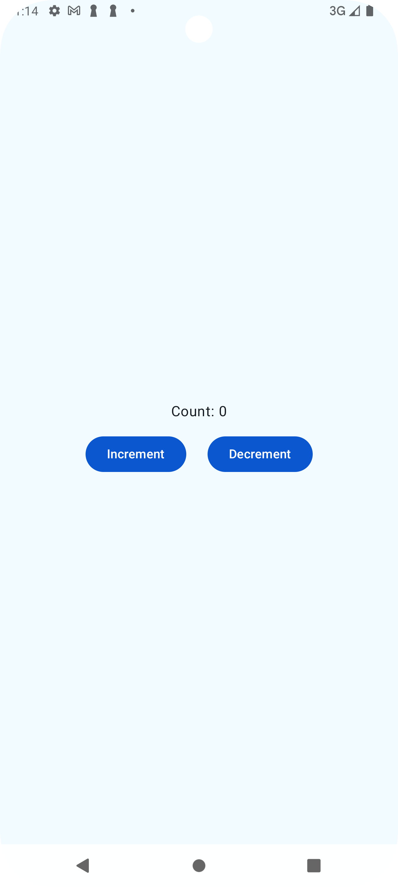
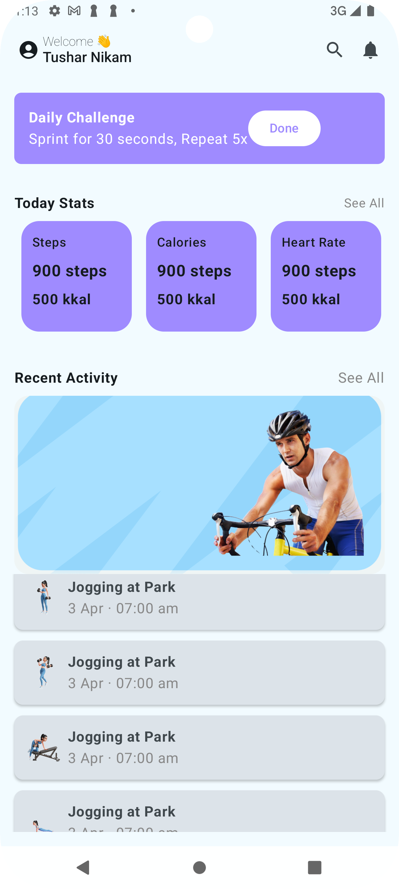

# Android Learning Projects

This repository contains a collection of simple Android applications built while learning Android development with Kotlin and Jetpack Compose. Each app demonstrates different concepts and UI patterns in modern Android development.

## Example Apps

### 1. CounterApp

A minimal counter application using Jetpack Compose and MVVM architecture.  
Features increment and decrement buttons with state management via a ViewModel.

---

### 2. GymWorkoutX

A fitness dashboard app UI built with Jetpack Compose.  
It showcases a daily challenge card, today's stats, and recent activity sections, focusing on layout and theming.

---

### 3. NewsStory

A news feed app UI that demonstrates fetching and displaying articles using Retrofit for networking and Coil for image loading.  
It includes theming, custom cards, and a responsive feed layout.

---

## How to Run

1. Clone the repository.
2. Open the project in Android Studio.
3. Select the desired app module (`CounterApp`, `GymWorkoutX`, or `NewsStory`).
4. Build and run on an emulator or device.

---

## Screenshots

|         CounterApp         |           GymWorkoutX           |           Newx           |
| :------------------------: | :-----------------------------: | :-----------------------------: |
|  |  |  |

---

## License

This repository is for learning and demonstration purposes.
